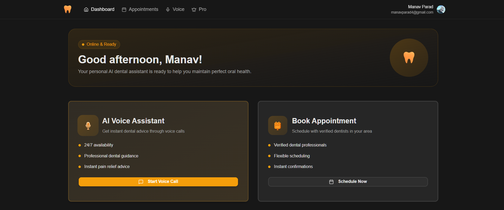
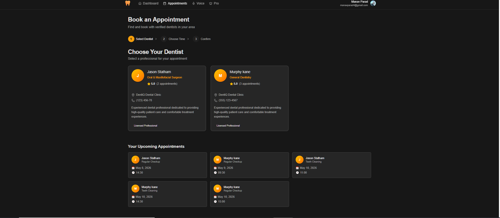
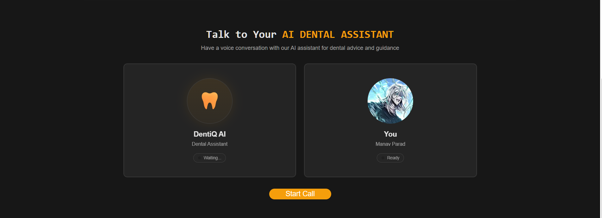
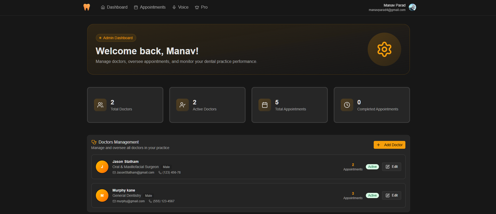

<div align="center">


# DentiQ 🦷

**AI-powered dental appointment platform with voice assistant**

[](https://denti-q.vercel.app)
[](https://nextjs.org)
[](https://typescriptlang.org)
[](https://supabase.com)
[](https://clerk.com)

</div>

---

## What is DentiQ?

DentiQ lets patients **chat with an AI voice assistant** about their dental symptoms, **book appointments** with verified dentists, and **track their dental health** — all in one place.

Admins get a separate dashboard to manage doctors, view all appointments, and update statuses in real time.

---

## Screenshots

> **Take these 5 screenshots and drop them in `/public/screenshots/` — then this section is done.**

### Landing Page


### Patient Dashboard


### Book Appointment


### AI Voice Assistant


### Admin Panel


---

## Features

### Patient
- 🎙️ **AI Voice Assistant** — powered by Vapi AI, talk about your dental concern and get instant guidance
- 📅 **Appointment Booking** — pick a doctor, date, and time slot in under a minute
- 📋 **Appointment History** — view upcoming and past appointments from your dashboard
- 📧 **Email Notifications** — confirmation emails sent via Resend on every booking
- 🔐 **Secure Auth** — Clerk handles login, signup, and session management

### Admin
- 👨‍⚕️ **Doctor Management** — add, edit, and manage doctor availability
- 📊 **Analytics Dashboard** — appointments overview and status tracking
- ✅ **Appointment Status** — approve, complete, or cancel appointments

---

## Tech Stack

| Layer | Technology |
|---|---|
| Framework | Next.js 15 (App Router + Server Actions) |
| Language | TypeScript |
| Auth | Clerk |
| Database | Supabase (PostgreSQL) |
| ORM | Prisma |
| AI Voice | Vapi AI |
| Email | Resend |
| Styling | Tailwind CSS + shadcn/ui |
| Deployment | Vercel |

---

## Project Structure

```
src/
├── app/
│   ├── (root)/          # Public pages (landing, pricing)
│   ├── (auth)/          # Clerk auth pages
│   ├── dashboard/       # Patient dashboard
│   ├── admin/           # Admin panel
│   └── api/             # API routes
├── components/
│   ├── ui/              # shadcn primitives
│   └── modules/         # Feature components
├── lib/
│   ├── actions/         # Server Actions
│   ├── prisma.ts        # Prisma client
│   └── utils.ts
└── middleware.ts        # Clerk protected routes
```

---

## Getting Started

### 1. Clone the repo

```bash
git clone https://github.com/manav1913/DentiQ.git
cd DentiQ
```

### 2. Install dependencies

```bash
npm install
```

### 3. Set up environment variables

Create a `.env` file in the root:

```env
# Clerk
NEXT_PUBLIC_CLERK_PUBLISHABLE_KEY=
CLERK_SECRET_KEY=

# Supabase (use Transaction Pooler URL for Vercel)
DATABASE_URL=postgresql://...pooler.supabase.com:6543/postgres?pgbouncer=true

# Vapi AI
NEXT_PUBLIC_VAPI_API_KEY=
NEXT_PUBLIC_VAPI_ASSISTANT_ID=

# Resend
RESEND_API_KEY=
```

### 4. Set up the database

```bash
npx prisma generate
npx prisma db push
```

### 5. Run locally

```bash
npm run dev
```

Open [http://localhost:3000](http://localhost:3000)

---

## Deployment

Optimised for Vercel. Import the repo, add the env variables above, and deploy.

> **Note:** For Supabase on Vercel, always use the **Transaction Pooler** connection string (port `6543` with `?pgbouncer=true`), not the direct connection string.

---

## Author

Built by **Manav** — [github.com/manav1913](https://github.com/manav1913)
